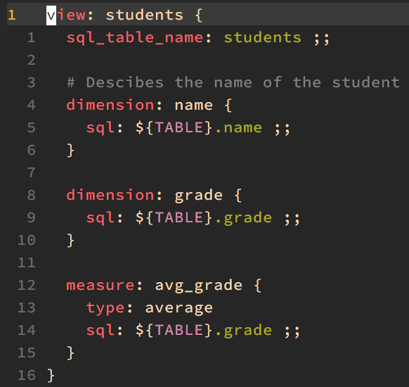

# lkml.vim

A (new) LookML syntax for vim.



# Install

To install, use any Vim plugin manager. For example, with
`[vim-plug](https://github.com/junegunn/vim-plug)`, add the following line to
your `.vimrc`.

```
Plug 'thalesmello/lkml.vim'
```
